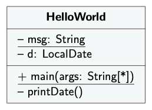
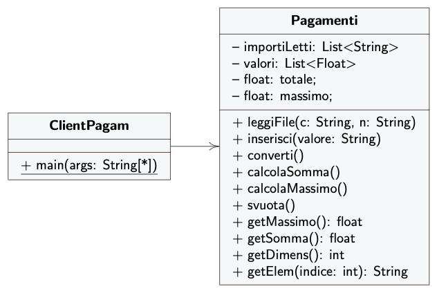

# Codice per le prime lezioni di Ingegneria del Software

### Corso di Laurea in Informatica, Università di Catania

### Benvenuti

Guardare prima il codice della classe `HelloWorld.java` per imparare la sintassi Java di creazione di metodi e classi. Notare il metodo `static`, i campi `static` e `final`, e l'istanziazione di un oggetto con `new`.

Quindi guardare il codice della classe `CalcolaImporti01.java`, il suo client `ClientCalcola.java`, poi la versione `CalcolaImporti02.java`. 

Infine, guardare la versione finale `Pagamenti.java`, il suo client `ClientPagam.java` e il codice di test `TestPagamenti.java`.

### Buon divertimento
